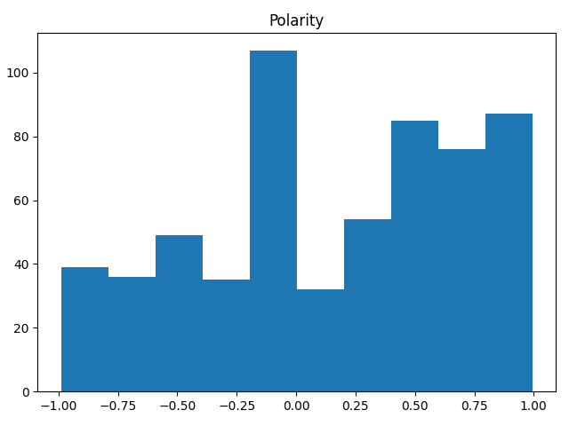

# "Woke Libs" and "Orange Men": A Statistical Analysis of Polarity of Comments on Local News Articles
By: Daniel Sampson, May 2025

## Introduction
I have a bad habit I need to confess: I read the comments section on local news sites. Every time I do, I only end up getting angry and upset, but I still keep coming back for more. As I sifted through the trash on the internet, I developed a question: if I switched to a different news site, would the comments be better? Also, does the topic of the news article affect the negativity of the comments? I decided to learn how to scrape data from the web in order to answer this question statistically.

## Methods
I decided to compare the polarity of comments from two local news sites, Deseret News and KSL News. (I would love to have analyzed the Salt Lake Tribune as well, but their articles require a paid subscription.) I designed a Python script to request comments from the API that served objects to the page (all code used in this project is available in this GitHub repository). In order to get as random of a sample as possible, I scraped every comment from news articles labeled Politics, Business, or Sports posted on Deseret News or KSL on or between the dates of April 6, 2025 and April 12, 2025. Hopefully, these articles would cover similar current events and would be old enough that new comments were not being added.  A total of 9006 comments were scraped from 218 webpages. From these 9006 comments, I randomly picked 100 comments from each combination of news site and article topic, for a total of 600 comments.

Each comment was analyzed with the VADER model for sentiment analysis. Published by C. Hutto and Eric Gilbert in 2010, VADER is a lexicon-based model that was specifically designed for social media/microblog style text. It scores strings on a scale from -1.0 to 1.0, where -1.0 is the most negative and and 1.0 is the most positive. While it does not have the accuracy that a machine learning model could provide, it was lightweight and easy for me to implement in an experiment that is mostly meant to show off programming skills.

## Model

I decided to use a linear model for my data, and analyze it with ANOVA. The model is as follows:

$$y_{ij} = \mu+\alpha_i+\beta_j+(\alpha\beta)_{ij}+\epsilon_{ijk}$$
$$i=1,2;j=1,2,3;k=1,2,...,100$$
where $y_{ij}$ is the observed polarity of a comment, $\mu$ is the mean polarity, $\alpha_i$ is the effect news site $i$ had on polarity, $\beta_j$ is the effect article topic $j$ had on polarity, $(\alpha\beta)_{ij}$ is the interaction effect between news site $i$ and article topic $j$, and $\epsilon_{ij}$ is the error term for observation $k$ under treatment level $ij$.

In order to use this model, we have to meet some basic assumptions. 

1. The first is that the data is normal. As can be seen in the histogram below, this is kind of a stretch. However, I used quite a large sample size for each treatment, so even though the data is not very normal, I feel good about using it.

2. The second is that the observations are independent of each other. Will one comment's polarity affect another's? Unfortunately, it is very possible, because many of the comments are replies to other comments. However, I will note this and go ahead with the analysis.
3. The standard deviations of the different treatments are actually super similar, hovering at about .5.
4. The residuals, while not looking normal, look roughly unimodal and centered at 0.

## Analysis

We'll begin with some exploratory data analysis.

| Site | Topic | Mean | Std Dev |
| --- | --- | --- | --- |
| Deseret | Business | 0.10937 | 0.50458 |
| Deseret | Politics | 0.10436 | 0.55889 |
| Deseret | Sports | 0.34697 | 0.52269 |
| KSL | Business | 0.15725 | 0.57990 |
| KSL | Politics | 0.04707 | 0.56103 |
| KSL | Sports | 0.18934 | 0.51908 |

It looks like the average score of comments is hovering around 0.1 polarity, or slightly positive, with Sports comments a little higher. However, the data are super variable. This seems to be corroborated by the boxplots by site and topic.

If we take a look at the interaction plot, there seems to be no real interaction between site and topic on polarity.

When we look at the ANOVA table, our suspicions seem to be confirmed.

| | df | sum_sq | mean_sq | F | PR(>F) |
| --- | --- | --- | --- | --- | --- |
C(Site) | 1.0 | 0.464984 | 0.464984 | 1.584354 | 0.208629 |
C(Topic) | 2.0 | 3.902351 | 1.951175 | 6.648305 | 0.001395 |
C(Site):C(Topic) | 2.0 | 1.056012 | 0.528006 | 1.799093 | 0.166349 |
Residual | 594.0 | 174.329882 | 0.293485 | | |

We find no significant effect of Site on polarity or interaction effect, but there is a significant effect of Topic on polarity, most likely telling us that Sports articles are significantly more positive than other articles.

When we look at the effect size of this effect, though, we realize that this effect, while it may be real, is not very big. The partial-eta squared value of Topic effect is only 0.021895, meaning that after accounting for the effects of other terms in our model, Topic only explains about 2% of the variance in polarity. The entire model only has an eta-squared of 0.030171, so the whole model only explains 3% of the variance in polarity.

## Conclusion and Limitations

In conclusion, the only statistically significant effect I found on polarity of online news comments was the topic of the news article. However, the effect size is very low, suggesting that if this effect does exist, it is very small.

As a demonstration of my data scraping, analysis, and visualization skills, this experiment fulfilled its purpose. However, there are many problems in the experiment design that, if fixed, would help me to get a much better conclusion.

First, not all assumptions were met. As noted above, we cannot guarantee that observations of polarity are independent of each other. It seems quite likely that a very negative comment will elicit very negative replies, and my current model assumes that all of these comments are independent. If I did this experiment again, I might only scrape the first level of comments (excluding replies), or somehow block for this factor.

Another possible problem affecting the independence of observations is that many are taken from the same article. Again, it is very likely that comments from the same article will have very similar polarity, violating independence. I could block for this and hopefully explain some of the residual variance with that.

These problems are all secondary to the biggest problem of the study: polarity is just not a good response variable. A quick search online shows that the widespread consensus is that lexicon-based sentiment analysis will always be less accurate than a machine learning model. We can kind of see that by looking at the polarity scores of some of the comments. Take a look at this one:

> Curtis: a Democrat hiding as a republican because Democrats have sullied their brand so much no Democrat could or should ever be elected. Hence all of the "3rd party options" that keep showing up in Utah, full  of people who claim to be for a third way but, curiously, never ever ever criticize a single Democrat politician or policy, all while they unload on Republicans.  Some "third party" they are.  Curtis actually was a Democrat at one point, as I recall, and just changed his name but not his character or ideas, unlike Reagan or Trump. Both of them also used to be Democrats, and then saw the light.

This comment, while most would mark it as negative due to its negative view of Democratic Party and Senator John Curtis, was scored 0.7038 by VADER. Some of the inaccuracy might be because of sarcasm:

> Sure. I totally trust you politically assessments. Since you were totally right when Trump was president elect about the saner people on his team would be talking him down from the ledge his tariff obsession….

As a lexicon-based model, it scores words separately, and while phrases like "totally trust" and "totally right" are positive, presumably the author is using sarcasm to convey a negative message. This comment scored 0.7089.

But not only is the accuracy of VADER for this project insufficient, it's probably not a super valid measure of what I was looking for, either. Am I looking for comments that only use positive words? That only agree with each other? No, I think a good comments section can have disagreement and discussion. What I'm looking for is a measurement of civility, and polarity does not do the job.

A more valid measurement might use machine learning to create a model. Getting several people to rate comments from civil to uncivil and training a machine learning model on it could give a much better response variable.

So, what did I learn? A whole lot about the Python `requests` library, webscraping using website APIs, `pandas`, `statsmodels`, and `matplotlib`. But what did I learn about where I could find comments on news sites that wouldn't make me mad? Not much, unless I want to only read Sports articles for the rest of my life. But this experiment did give me some things to think about, and I would love to do further research on the same topic with more resources.